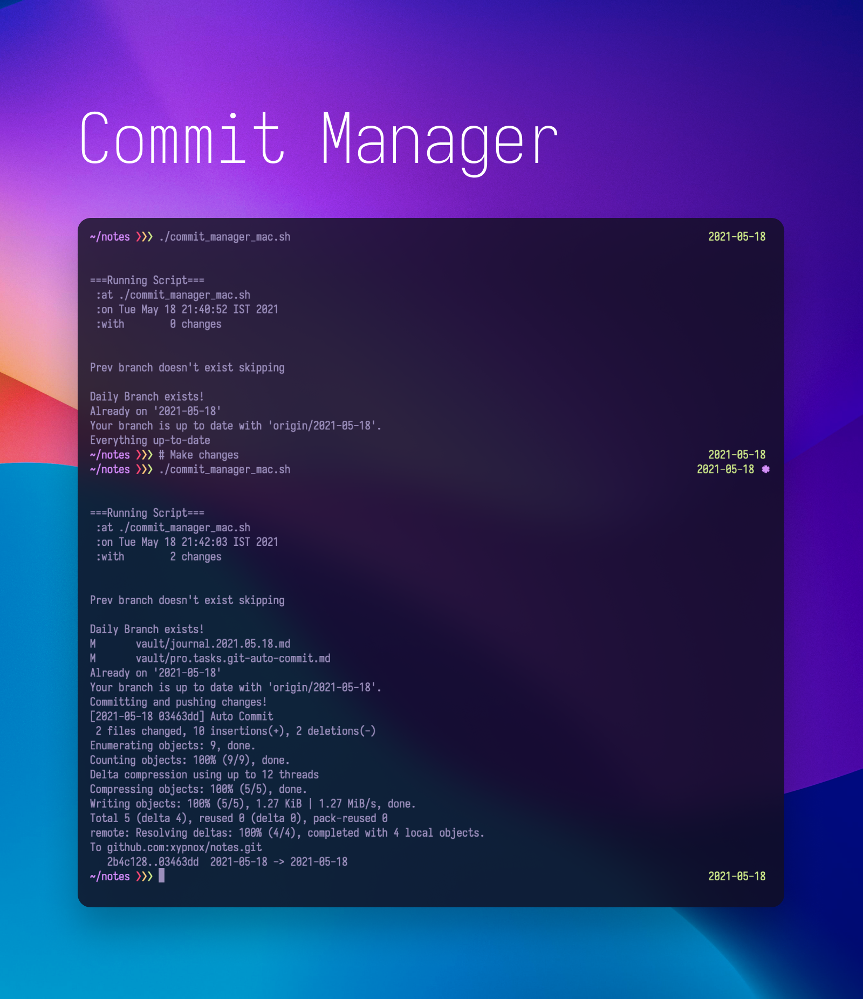

Setup-and-forget automated commit and push for git with linear daily commit history.

For mac see the `commit_manager_mac.sh` script.

Auto commit script

- Should Commit every 10 minutes to daily branch
- Should Squash Merge Daily branch to main once every day
- Should push daily branch to github
- Should push main branch to github
- Should keep pruning the daily branches from both github and local git
- Should auto switch daily branches when next day

## Setup

> It is preferred that you use `ssh` to clone and setup git repo you want to track, this makes committing and pushing available for cronjobs without any setup for auth.

Although the script can work on it's own, it is better to setup a cronjob such that it runs automatically.

- Copy the script to the root of the repo you want to track.
- Update the config:
  ```bash
  # Config
  directory="/home/xypnox/notes/"
  ```
- Setup a cronjob to run it every 10 minutes.
  `*/10 * * * * bash /Users/apple/notes/commit_manager.sh`
- Additionally if you want to setup a log file to see if the git commands errored and when, extend the cronjob as:
  `*/10 * * * * bash /Users/apple/notes/commit_manager.sh >> /Users/apple/notes/commit_manager_log.txt 2>&1`

## TODO

- [ ] Handle skipped days.
- [ ] Add buffer before deleting day branches.
- [x] Figure out a way to push stuff.
- [x] Add squash commit.
- [x] Add loop every 10 minutes

## Notes

### Logic

For every 10 minutes do:

- Check if the previous day's branch is merged
  - If not commit and merge it
  - After merge, push `main` and delete yesterday's branch
    - Remote and local
- Check if the `main` after prev merge is pushed
  - If not do so
- Create today's branch if it doesn't exist
- If there are any changes
  - Commit and push changes on today's branch
